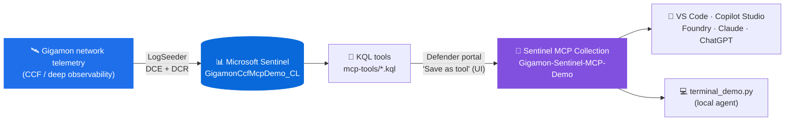

# Gigamon Sentinel MCP Demo (UI publish variant)

> **Variant:** This repo publishes the custom MCP tools through the **Microsoft Defender portal UI** ("Save as tool" flow), with no API publishing script. For the API-driven variant, see [`gigamon-sentinel-mcp-demo`](https://github.com/MitchellGulledge3/gigamon-sentinel-mcp-demo).

This repo is a GitHub-ready reference implementation for a Gigamon developer who wants to show an end-to-end Microsoft Sentinel custom MCP tool integration.

The purpose is not to ship another generic chatbot. The purpose is to show how an ISV can expose focused, high-value security capabilities as **MCP tools** over the data they already bring into Microsoft Sentinel. Once those tools exist, a terminal demo, an ISV product experience, a Copilot-style UI, or another agent runtime can call the same capability.

## The story in one sentence

Gigamon has rich network visibility in Sentinel; MCP turns that visibility into reusable agent tools such as "summarize posture," "triage lateral movement," "hunt DNS anomalies," and "summarize TLS risk."

## Architecture at a glance



## Recommended path for a live working session

If you are walking through this with a Gigamon developer, start here:

[`docs/working-session-guide.md`](docs/working-session-guide.md)

That guide is the most methodical path. It has roles, copy/paste commands, checkpoints, troubleshooting, and the exact places Gigamon would customize the pattern for their own platform.

## New to Sentinel? Read this first

| Term | Plain-English meaning |
| --- | --- |
| Microsoft Sentinel | Microsoft's cloud SIEM. It helps security teams collect logs, detect threats, investigate incidents, and respond. |
| Log Analytics workspace | The Azure data store Sentinel uses for logs. Think "database for security telemetry." |
| Table | A named set of rows in the workspace. This demo writes to `GigamonCcfMcpDemo_CL`. |
| KQL | Kusto Query Language. This is the query language used to search Sentinel logs. |
| LogSeeder | A sample-data tool that creates a table and inserts realistic demo rows. |
| DCE | Data Collection Endpoint. The Azure ingestion URL where custom log data is sent. |
| DCR | Data Collection Rule. The Azure rule that maps incoming data into the right table and columns. |
| MCP tool | A callable tool an agent can use. In this repo, each MCP tool runs one curated KQL query. |

The short version: **LogSeeder puts Gigamon-shaped rows into Sentinel; KQL asks useful security questions; MCP wraps those questions so an agent or app can call them.**

## What this demo proves

A Gigamon developer can:

1. Start from the official Sentinel connector table schema.
2. Use Sentinel LogSeeder to create a demo custom table and seed realistic telemetry.
3. Publish high-value KQL questions as Sentinel custom MCP tools.
4. Call those tools from a simple terminal prompt loop or any future agent runtime.

## Architecture

```text
Official Gigamon Sentinel schema
        |
        v
LogSeeder demo schema + sample value pools
        |
        v
GigamonCcfMcpDemo_CL in Log Analytics / Sentinel
        |
        v
KQL-backed custom Sentinel MCP tools
        |
        v
Interactive terminal demo that routes natural prompts to those tools
```

## What gets created

| Asset | Created by | Why it exists |
| --- | --- | --- |
| `GigamonCcfMcpDemo_CL` table | LogSeeder | Stores demo Gigamon CCF-style telemetry in Sentinel |
| Data Collection Endpoint | LogSeeder/Azure Monitor | Provides the ingestion endpoint for custom logs |
| Data Collection Rule | LogSeeder/Azure Monitor | Maps JSON fields into the custom table columns |
| `Gigamon-Sentinel-MCP-Demo` collection | Defender portal "Save as tool" UI | Groups the custom MCP tools |
| Eight MCP tools | Defender portal "Save as tool" UI | Expose repeatable Gigamon investigation questions |
| Terminal demo | `terminal_demo.py` | Lets a presenter call the tools from a prompt |

## Why this matters for Gigamon developers

The developer does not have to guess what an agent might need. They can package a small set of opinionated tools around the security questions Gigamon is best positioned to answer:

| Developer asset | Why it helps |
| --- | --- |
| Official table schema | Keeps the demo aligned to the real Gigamon Sentinel connector |
| LogSeeder schema | Lets a developer or seller stand up demo data without waiting on a live appliance |
| KQL files | Make the security logic inspectable, reviewable, and versionable |
| Defender portal "Save as tool" flow | Converts each KQL file into a callable custom tool — no code needed |
| Terminal demo | Shows the end-to-end tool call without Teams, browser, or admin-consent friction |
| Source annotations | Helps a developer understand and customize every moving part |

## Demo table

The demo table is `GigamonCcfMcpDemo_CL`. It uses the same column names and types as the official Sentinel Gigamon CCF table schema from:

```text
https://raw.githubusercontent.com/Azure/Azure-Sentinel/master/Solutions/Gigamon%20Connector/Data%20Connectors/Gigamon_CCF/Gigamon_table.json
```

The table name is intentionally different from `GigamonV2_CL` so the demo never collides with a production connector table.

The companion file `logseeder/GigamonCcfMcpDemo_CL.annotated.jsonc` explains the schema in a comment-friendly format. Keep `GigamonCcfMcpDemo_CL.json` as valid JSON for LogSeeder.

## End-to-end use case

**Use case:** a SOC analyst asks whether Gigamon network visibility data shows lateral movement, DNS anomalies, or TLS risk during a suspected intrusion.

The MCP tools expose that investigation as reusable capabilities:

| Tool | Purpose |
| --- | --- |
| `Gigamon_Visibility_Posture_Summary` | Executive posture summary: events, sources, destinations, apps, protocols, bytes |
| `Gigamon_Lateral_Movement_Triage` | Triage SMB/RDP/SSH east-west movement candidates |
| `Gigamon_DNS_Anomaly_Hunt` | Hunt suspicious or slow DNS activity |
| `Gigamon_TLS_Risk_Summary` | Summarize weak TLS, weak keys, expiring certs, JA3/JA3S signals |
| `Gigamon_Top_Talkers_By_App` | Find top applications, sources, destinations, bytes, packets |
| `Gigamon_JA3_Threat_Match` | ★ Match observed JA3/JA3S to known-bad C2/RAT fingerprints (Cobalt Strike, Sliver, Trickbot, Emotet, Tor) |
| `Gigamon_Beacon_Periodicity_Hunt` | Detect C2 beaconing via inter-arrival jitter + IQR per (src,dst,port) |
| `Gigamon_Shadow_IT_App_Discovery` | Discover unsanctioned apps (P2P, Tor, consumer VPN, RMM, personal cloud, crypto-mining) |

For the full narrative, value proposition, latest real outputs, and talk track for each tool, see [`docs/tool-use-cases.md`](docs/tool-use-cases.md).

## Prerequisites

You'll need:

1. **An Azure subscription** with a **Log Analytics workspace** that has **Microsoft Sentinel data lake** enabled and a **Microsoft Defender** license attached.
2. **Defender portal roles** (one of these on the workspace) to *create* custom tools: **Security Operator**, **Security Admin**, or **Global Admin**. To *invoke* the tools later: **Security Reader** or **Global Reader**.
3. **Azure CLI** (`az`) authenticated against the subscription:
   ```bash
   brew install azure-cli         # if you don't already have it
   az login
   az account set --subscription "<subscription-id-or-name>"
   ```
4. **PowerShell 7** (used by LogSeeder for data seeding):
   ```bash
   brew install --cask powershell
   pwsh --version                  # should report 7.x
   ```
5. **Python 3.9+** for the terminal demo (`python3 --version`).
6. **`sentinel-logseeder`** — Microsoft's sample-data tool. Clone it once anywhere on disk:
   ```bash
   git clone https://github.com/microsoft/sentinel-logseeder.git
   ```
   The path `<wherever-you-cloned-it>` is what you'll substitute for `$LOGSEEDER` below.

### Get your workspace customer ID

Several steps below ask for `<workspace-customer-id>`. That's the Log Analytics **workspace ID** (a GUID), **not** the Azure resource ID. Find yours with:

```bash
az monitor log-analytics workspace show \
  --resource-group <rg> \
  --workspace-name <workspace> \
  --query customerId -o tsv
```

Use that value wherever this README says `<workspace-customer-id>`.

## Seed data with LogSeeder

This step creates the custom table and sends demo rows into Sentinel. If you are new to Azure Monitor ingestion, the important part is that LogSeeder hides most of the plumbing: it creates or reuses a DCE, creates a DCR, maps the schema, and posts sample data.

From the root of **this** repo (the `-ui` repo):

```bash
# Make these point at your paths
export REPO_ROOT=$(pwd)                       # this repo
export LOGSEEDER=/path/to/sentinel-logseeder  # where you cloned LogSeeder

cp "$REPO_ROOT/logseeder/GigamonCcfMcpDemo_CL.json" "$LOGSEEDER/schemas/"
cd "$LOGSEEDER"
pwsh -NoLogo -NoProfile -ExecutionPolicy Bypass \
  -File ./scripts/Invoke-SampleDataIngestion.ps1 \
  -TableName GigamonCcfMcpDemo_CL \
  -Schema ./schemas/GigamonCcfMcpDemo_CL.json \
  -RowCount 250 \
  -TimeWindowMinutes 1440 \
  -Deploy -Ingest
```

Verify rows:

```kql
GigamonCcfMcpDemo_CL
| summarize RowCount=count(), FirstSeen=min(TimeGenerated), LastSeen=max(TimeGenerated)
```

If the query returns zero rows immediately after ingestion, wait a few minutes and query again. New custom tables and DCR mappings can take time to become queryable.

Useful validation queries:

```kql
GigamonCcfMcpDemo_CL
| summarize Events=count(), Apps=make_set(app_name, 20), Protocols=make_set(protocol, 10)
```

```kql
GigamonCcfMcpDemo_CL
| where dst_port in ("445", "3389", "22")
| summarize Flows=count(), Bytes=sum(tolong(total_bytes)) by dst_port, app_name
| order by Bytes desc
```

```kql
GigamonCcfMcpDemo_CL
| where app_name == "dns" or dst_port == "53"
| summarize Queries=count(), Failed=countif(dns_reply_code in ("NXDOMAIN", "SERVFAIL")) by dns_query_type
```

## Publish custom MCP tools (UI flow)

This variant of the demo does **not** include an API publisher script. Instead, you save each KQL query as a custom MCP tool by hand in the Microsoft Defender portal's Advanced Hunting page using the **Save as tool** flow.

Suggested collection name:

```text
Gigamon-Sentinel-MCP-Demo
```

Full step-by-step walkthrough (with field-by-field guidance and the official Microsoft Learn links):

➡️ [`docs/publish-tools-via-ui.md`](docs/publish-tools-via-ui.md)

Short version:

1. Open https://security.microsoft.com → **Investigation & response** → **Hunting** → **Advanced hunting**.
2. Paste a KQL file from `mcp-tools/`, run it once to confirm rows.
3. Click **Save as tool** (context menu or KQL box menu).
4. In the flyout, set **Name** = the `.kql` filename without extension, paste the matching **Description**, choose or create the `Gigamon-Sentinel-MCP-Demo` **Collection**, set the **Default workspace** to your Sentinel workspace.
5. Repeat for every `.kql` file in `mcp-tools/`.

Reference: [Create and use custom Microsoft Sentinel MCP tools (preview)](https://learn.microsoft.com/azure/sentinel/datalake/sentinel-mcp-create-custom-tool)

## Terminal demo

Run the included interactive terminal demo (from the root of **this** repo):

```bash
cd /path/to/gigamon-sentinel-mcp-demo-ui
python3 -m venv .venv
source .venv/bin/activate
pip install -r requirements.txt
cp .env.example .env
```

Edit `.env` and set:

```text
MCP_DEFAULT_ARGUMENTS={"workspaceId":"<workspace-customer-id>"}
```

Then start the app:

```bash
python3 terminal_demo.py --show-raw
```

Type prompts like:

```text
Summarize Gigamon visibility posture
Show possible lateral movement
Hunt DNS anomalies
Summarize TLS risk
Show top talkers by app
```

For a single command you can paste into a demo script, run:

```bash
python3 terminal_demo.py --prompt "Show possible lateral movement" --show-raw
```

The terminal demo has a simple prompt router:

| Prompt contains | Tool selected |
| --- | --- |
| `lateral`, `east-west`, `rdp`, `smb`, `ssh` | `Gigamon_Lateral_Movement_Triage` |
| `dns`, `domain`, `lookup`, `nxdomain`, `servfail` | `Gigamon_DNS_Anomaly_Hunt` |
| `tls`, `ssl`, `cert`, `certificate`, `weak key` | `Gigamon_TLS_Risk_Summary` |
| `top`, `talker`, `app`, `bytes`, `packets` | `Gigamon_Top_Talkers_By_App` |
| `ja3`, `fingerprint`, `c2 fingerprint` | `Gigamon_JA3_Threat_Match` |
| `beacon`, `beaconing`, `periodicity`, `callback` | `Gigamon_Beacon_Periodicity_Hunt` |
| `shadow it`, `tor`, `bittorrent`, `personal vpn`, `crypto miner` | `Gigamon_Shadow_IT_App_Discovery` |
| anything else | `Gigamon_Visibility_Posture_Summary` |

This router is intentionally simple. In a production ISV app, this could be replaced with an LLM planner, a workflow engine, or explicit UI buttons.

## Troubleshooting quick hits

| Symptom | Likely cause | Fix |
| --- | --- | --- |
| `az` token errors | Azure CLI is not signed in or points to the wrong tenant/subscription | Run `az login` and `az account set --subscription <id>` |
| Ingestion succeeds but queries return 0 rows | Table/DCR propagation delay | Wait a few minutes and rerun the KQL |
| MCP publish fails with permission errors | Missing Sentinel custom MCP management permission | Use an account with access to publish tool collections |
| Terminal demo says workspace is missing | `.env` does not contain `MCP_DEFAULT_ARGUMENTS` | Set `{"workspaceId":"<workspace-customer-id>"}` |
| Tool returns no rows | Demo data aged out or was not ingested | Re-run LogSeeder with a fresh `TimeWindowMinutes` |

## Talk track

> Gigamon does not need to ship a whole chatbot to participate in agent workflows. The developer ships focused tools over the data they know best. Microsoft Sentinel handles the data plane, MCP gives the tool contract, and any agent surface can call the capability.

## Source notes

The repo includes detailed notes for developers who want to customize the implementation:

| File | Purpose |
| --- | --- |
| `docs/source-line-notes.md` | Line-by-line explanation for every Python and JSON file in the repo |
| `logseeder/GigamonCcfMcpDemo_CL.annotated.jsonc` | Commented companion to the LogSeeder JSON schema |

JSON does not support comments, so the runnable `.json` files stay valid and the comments live in `.jsonc` or Markdown.

## How to adapt this for production

For a real Gigamon-delivered asset, replace the demo pieces as follows:

| Demo piece | Production direction |
| --- | --- |
| `GigamonCcfMcpDemo_CL` | Use the real `GigamonV2_CL` table or customer-selected table |
| LogSeeder sample values | Use real product telemetry from the connector |
| Static prompt router | Use explicit product UI actions or an agent planner |
| Terminal demo | Embed the same tool calls into a Gigamon console, Copilot-like app, or partner integration |
| Single workspace ID | Let customer configuration choose the Sentinel workspace |

## Files

| Path | Purpose |
| --- | --- |
| `logseeder/GigamonCcfMcpDemo_CL.json` | LogSeeder schema derived from the official Gigamon connector schema |
| `logseeder/GigamonCcfMcpDemo_CL.annotated.jsonc` | Commented explanation of the schema without breaking valid JSON |
| `mcp-tools/*.kql` | KQL definitions for custom Sentinel MCP tools (one tool per file) |
| `docs/publish-tools-via-ui.md` | Step-by-step UI walkthrough for saving the KQL files as Sentinel custom MCP tools |
| `terminal_demo.py` | Interactive terminal prompt loop that routes prompts to the Gigamon MCP tools |
| `sentinel_mcp_demo/` | Minimal Sentinel MCP client used by the terminal demo |
| `docs/demo-script.md` | Step-by-step presenter script |
| `docs/working-session-guide.md` | Methodical live-call walkthrough for Microsoft + Gigamon |
| `docs/tool-use-cases.md` | Detailed use-case, value-add, and story guide for every MCP tool |
| `docs/source-line-notes.md` | Exhaustive source-line notes for Python and JSON files |

---

## Live capture — all 8 tools (May 13, 2026)

These are the actual MCP tool responses against the live `GigamonCcfMcpDemo_CL` table in the demo workspace. Each row is one `terminal_demo.py --show-raw --prompt "..."` invocation.

| Tool | Headline result |
| --- | --- |
| `Gigamon_Visibility_Posture_Summary` | 1,500 events · 5 sources · 5 destinations · 3.05 GB · apps include `telegram`, `twitch`, `trickbot` |
| `Gigamon_Lateral_Movement_Triage` | 202 candidate flows on dst port 22 · 459 MB · 5 sources / 5 destinations |
| `Gigamon_DNS_Anomaly_Hunt` | 491 A queries · 345 failed · 254 slow · suspicious: `rare-beacon.bad-example.test` |
| `Gigamon_TLS_Risk_Summary` | 482 TLS 1.0 sessions · 162 weak-key obs · 160 expiring certs |
| `Gigamon_Top_Talkers_By_App` | `https / remote-admin` over TCP — 24 flows · 69 MB |
| ★ `Gigamon_JA3_Threat_Match` | **1,500 handshakes · 9 unique JA3 · 536 known-bad hits** across Cobalt Strike, Sliver, Trickbot, Emotet, Tor, Adwind RAT |
| `Gigamon_Beacon_Periodicity_Hunt` | 737 flows · 100 src/dst pairs · 0 candidate beacons (clean baseline) |
| `Gigamon_Shadow_IT_App_Discovery` | 331 shadow flows · 701 MB · 44 hosts · 9 categories · 4 high-risk hits |

### Why JA3 is the flagship

EDR cannot see TLS handshake fingerprints. Only a deep-observability sensor on the wire (Gigamon) can. With one MCP tool call from natural language, Security Copilot now answers *"are any TLS clients fingerprinting as Cobalt Strike?"* with **536 hits across six threat families**.

### Note on the "0 beacons" result

The beacon hunter returns 0 candidate beacons against the current data — that's the **expected, clean** state. The tool flags pairs only when jitter < 0.25 AND IQR ratio < 0.3 AND median gap ≥ 15s. The companion notebook [`04-beacon-periodicity-analysis.ipynb`](https://github.com/MitchellGulledge3/gigamon-sentinel-notebooks) does the same math visually so analysts can drill in even when the MCP tool returns "all clear."
